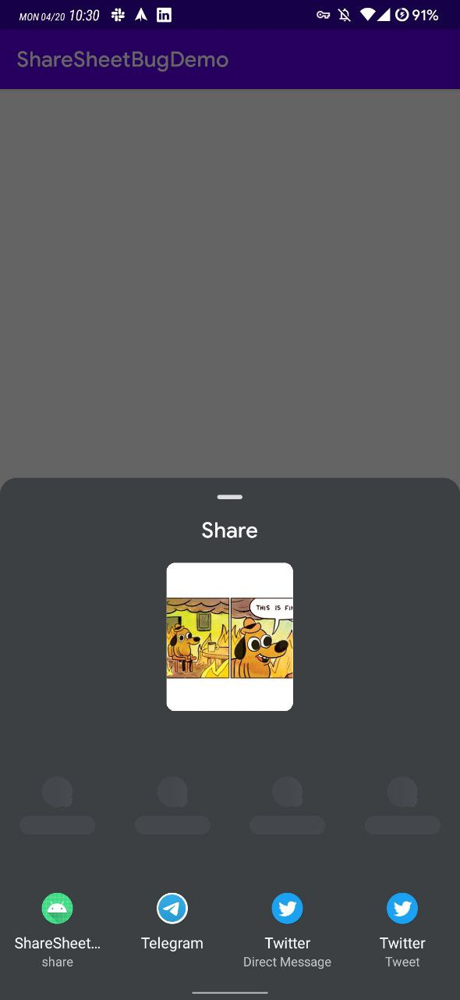

# Share Sheet Bug Demo

# Expected: (Android Q / QQ2A.200405.005)

- Share sheet pops up
- And it waits for users to choose

# Actual Result: (Android R DP2.1 / RPP2.200227.014)

- Share sheet does not pop up or immediately slides out once it pops up
- It triggers the first intent defined in the initial intent array.

# How to reproduce

- Build & run the app
- Click share button
